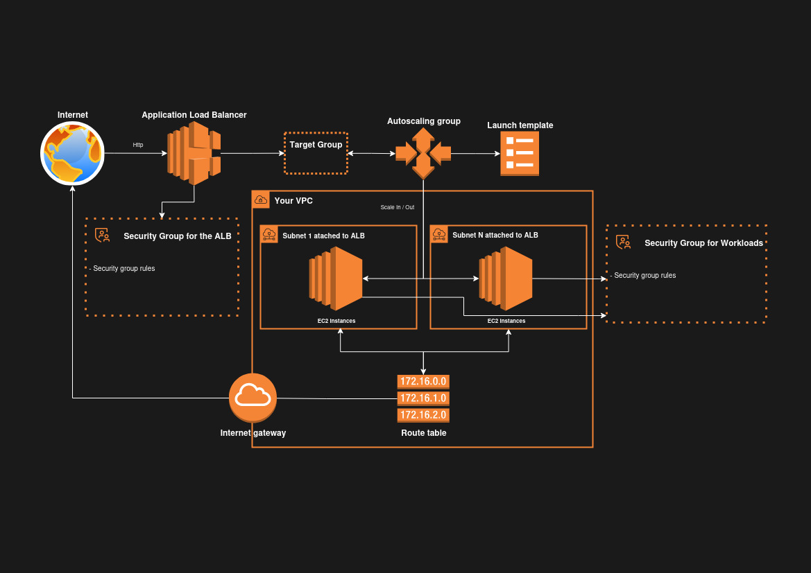

# Naiboa

## The problem

The setup of an aws environment for running high availability http services require the creation, connection and configuration of many resources. Even if you made it for one environment, you will likely need to repeat the process when recreating or replicating other environments.

## The solution

A terraform module that covers the declaration and configuration of all required aws resources to implement load balancing and auto-managed redundancy. You only provide parameters specific to your implementation like ports, healthchecks, cidr blocks, etc and the module will build the environment.

It implements practices of security, high availability and monitoring so you focus on templating the EC2 workload for your http service.

## Architecture diagram



## 🚀 Setup instructions

Clone this repository and proceed with steps below.

### Parameters

Create a `terraform.tfvars` file with the following content, updating the values to suit your environment:

```hcl
env_prefix              = "any-env-prefix"
ingress_cidr_blocks     = ["your-public-ip-address/32"]
instance_type           = "the-aws-instance-type"
min_size = 1
max_size = 3
quantity_avg_cpu_utilization = 40
quantity_request_count_per_target = 2
ssh_public_key_location = "path-to-your-public-key"
subnets_specs = {
    "subnet-1" = {
        avail_zone = "us-east-1a"
        cidr_block = "10.2.1.0/24"
    }
    "subnet-2" = {
        avail_zone = "us-east-1b"
        cidr_block = "10.2.2.0/24"
    }
}
vpc_cidr_block          = "cidr-block-for-your-vpc"
```

Install providers and modules:

```hcl
terraform init
```

Call the module(See examples folder for a basic invoing example). You need to provide input parameters like the target vpc_id, the target ami_id, the target instance_type, etc. Provision those from the prepared `terraform.tfvars` file.

```hcl
module "alb_with_autoscaling" {
    source = "relative-path-to-the-root-of-repo"

    ami_id                                  = var.ami_id
    env_prefix                              = "dev"
    ingress_cidr_blocks                     = var.ingress_cidr_blocks
    instance_type                           = "t2.micro"
    min_size                                = var.min_size
    max_size                                = var.max_size
    quantity_avg_cpu_utilization            = var.quantity_avg_cpu_utilization
    quantity_request_count_per_target       = var.quantity_request_count_per_target
    subnets_specs                           = var.subnets_specs
    ssh_public_key_location                 = var.ssh_public_key_location
    vpc_id                                  = aws_vpc.stack_vpc.id    
}
```

Then plan and apply:

```hcl
terraform plan

terraform apply
```